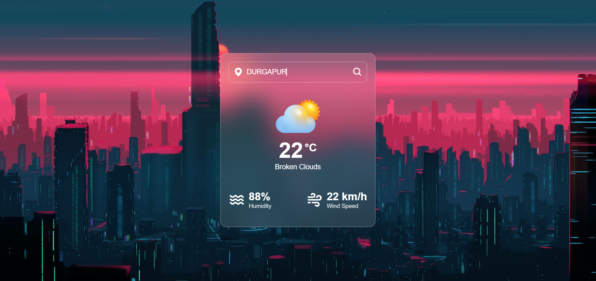

# 🌤️ Weather App

A sleek, responsive, and interactive Weather Application built with JavaScript, HTML5, and CSS3. This app provides real-time weather information for any city worldwide using the OpenWeatherMap API.

<br>



<br>

## ✨ Features

- **Real-time Weather Data**: Get accurate temperature, humidity, and wind speed for any location.
- **Interactive UI**: Smooth animations and transitions when searching for locations.
- **Glassmorphism Design**: Modern UI with a glass-like backdrop-filter and blurred effects.
- **Error Handling**: Displays a custom "Location Not Found" state when a search fails.
- **Responsive Design**: Fully centered and optimized for different screen sizes.
- **Boxicons Integration**: Uses high-quality icons for weather details and search.

## 🚀 Technologies Used

- **HTML5**: Semantic structure.
- **CSS3**: Custom styling, animations, and Glassmorphism effects.
- **JavaScript (ES6)**: Fetch API for real-time data and DOM manipulation.
- **OpenWeatherMap API**: For fetching global weather data.
- **Boxicons**: For modern iconography.
- **Google Fonts**: "Poppins" for clean typography.

## 🛠️ Installation & Setup

1. **Clone the repository**:

   ```bash
   git clone https://github.com/your-username/weather-app.git
   ```

2. **Open the project**:
   Simply open the `index.html` file in any modern web browser.

3. **API Configuration**:
   The app uses a default API key. To use your own:
   - Sign up at [OpenWeatherMap](https://openweathermap.org/api).
   - Get your API Key.
   - Replace the `API_KEY` variable in `script.js`:
     ```javascript
     const API_KEY = "your_api_key_here";
     ```

## 📂 Project Structure

```text
Weather App/
├── images/           # Local image assets (icons, background)
├── index.html        # Main HTML structure
├── script.js         # Weather fetching logic
└── style.css         # Modern styling & animations
```
